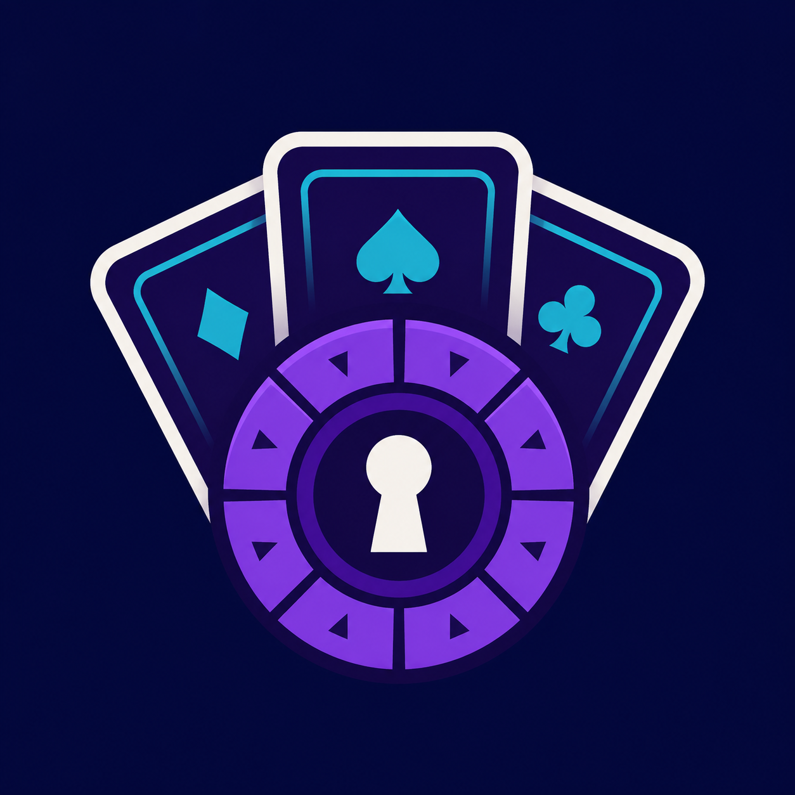
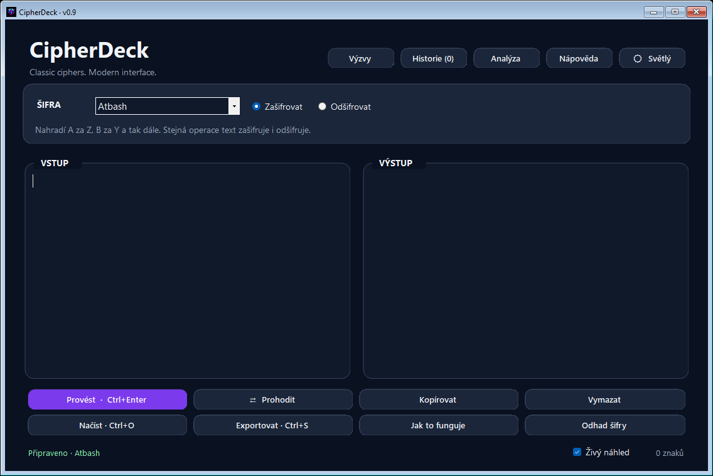
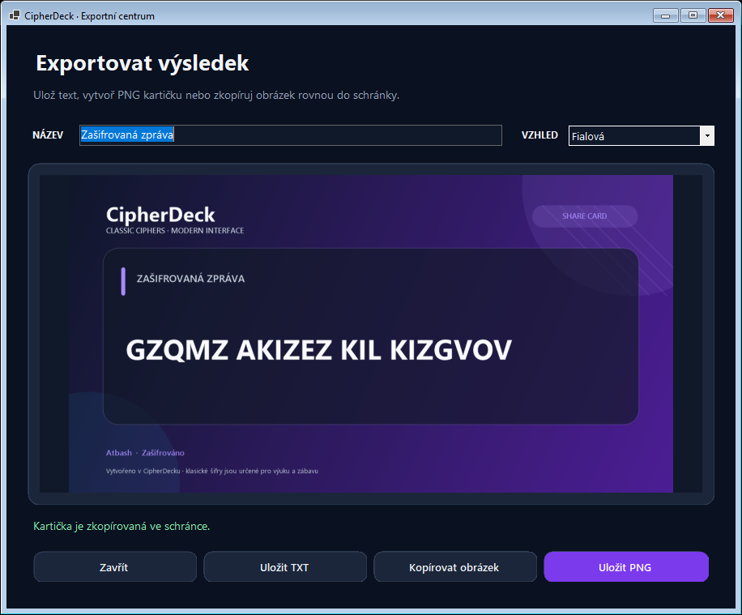
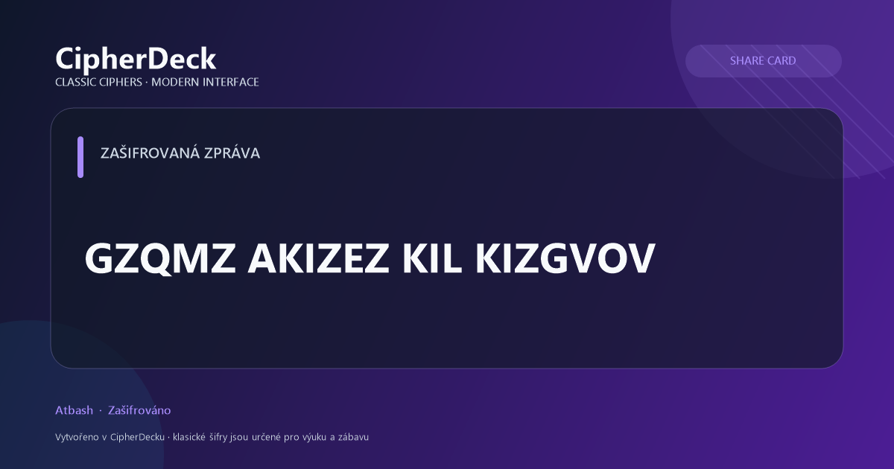

# CipherDeck

> Classic ciphers. Modern interface.

[](https://github.com/Sodicek/CipherDeck/actions/workflows/ci.yml)
[](https://github.com/Sodicek/CipherDeck/releases/latest)
[](LICENSE)

🇨🇿 [Přečíst česky](README.md)

<p align="center">
  
</p>

CipherDeck is a modern desktop app for trying out and understanding classic ciphers. It offers a clean interface, instant text conversion, and cipher algorithms that are kept separate from the UI and covered by automated tests.

<p align="center">
  
</p>

## What's in v0.9

- reverse text with correct Unicode support,
- the Caesar cipher with an adjustable shift,
- the Atbash cipher,
- the Vigenère cipher with a text key,
- the Rail Fence transposition cipher,
- character skipping with an adjustable step,
- encryption and decryption,
- swapping input with output,
- copying the result and a character counter,
- a live preview of the result while typing,
- a persistent history of the last 30 manually performed operations, with the ability to reload or clear it,
- light and dark themes, remembering both the chosen theme and the last used cipher,
- built-in help and descriptions for every supported cipher,
- importing and exporting UTF-8 text files,
- an export center with a live result preview,
- 1200 × 630 shareable PNG cards in three styles and image clipboard support,
- a custom application icon,
- letter frequency analysis with a chart and a detailed table,
- a Learn Mode that explains every cipher step by step,
- a generator for suitable numeric and text keys,
- cipher challenges in three difficulty levels, with hints and answer checking,
- heuristic detection of simple ciphers with a preview of the most likely result,
- consistent rounded controls with subtle hover, pressed, and focus states,
- polished cards, spacing, and color contrast in both light and dark themes,
- a precise grid of equally sized buttons without irregular wrapping,
- logical keyboard navigation, initial input focus, and control tooltips,
- keyboard shortcuts `Ctrl+Enter`, `Ctrl+O`, and `Ctrl+S`.

> [!WARNING]
> Classic ciphers are not safe for protecting passwords or sensitive data. CipherDeck is meant for learning and fun.

## Shareable cards

<p align="center">
  
</p>

<p align="center">
  
</p>

The export center keeps standard TXT exports and adds ready-to-share PNG cards. The title and visual style can be changed before saving or copying the image.

## Running the app

The project requires Windows and the [.NET 8 SDK](https://dotnet.microsoft.com/download/dotnet/8.0).

A ready-to-run build that doesn't need .NET installed is available in the [latest GitHub Release](https://github.com/Sodicek/CipherDeck/releases/latest).

```powershell
dotnet run --project CipherDeck.App/CipherDeck.App.csproj
```

## Tests

```powershell
dotnet test CipherDeck.sln
```

## Building a standalone Windows app

```powershell
dotnet publish CipherDeck.App/CipherDeck.App.csproj -p:PublishProfile=win-x64
```

## Project structure

- `CipherDeck.App` – CipherDeck's desktop UI,
- `CipherDeck.Core` – cipher algorithms, independent of the UI,
- `CipherDeck.Tests` – automated tests,
- `ToDo.md` – roadmap for future versions.

## Roadmap

Planned features include full English UI localization, an installer package, and further accessibility improvements.

The detailed plan lives in [ToDo.md](ToDo.md) (in Czech).

## Contributing

Suggestions and fixes are welcome. Before sending a pull request:

1. run `dotnet test CipherDeck.sln` and make sure every test passes,
2. for a new cipher, implement the `ICipher` interface and add automated tests for it,
3. briefly summarize what changed and why in the pull request description.

Report bugs or feature ideas via [GitHub Issues](https://github.com/Sodicek/CipherDeck/issues).

## License

This project is available under the [MIT license](LICENSE).
